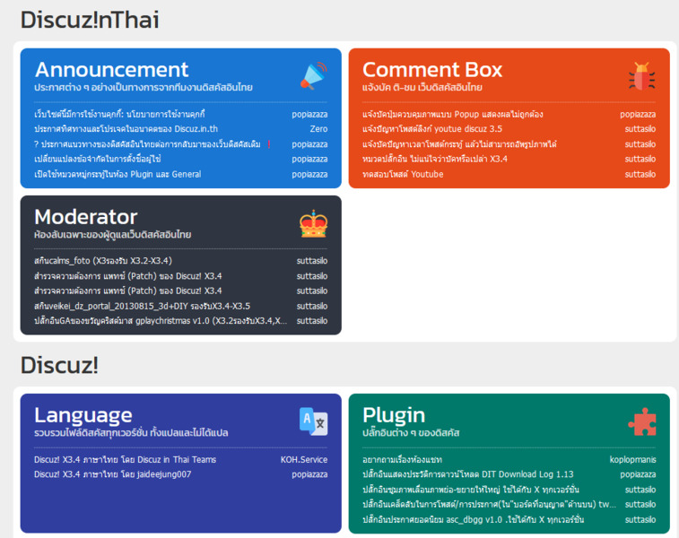

# Discuz.in.th Template

Discuz.in.th Template is a template for Discuz! X (CMS). This is the current template used in [Discuz.in.th](https://www.discuz.in.th) forum.

## วิธีการติดตั้ง

> ปัจจุบันสกินนี้ทำการ Mod ให้ใช้ [ปลั๊กอินแสดงประวัติการดาวน์โหลด DIT Download Log 1.13](https://www.discuz.in.th/thread/706/1/1) ไว้อยู่ กรุณาอ่านวิธีการติดตั้งหรือลบ Mod นี้ออกจากกระทู้ปลั๊กอินดังกล่าว

1. ดาวน์โหลดไฟล์ **discuzinth_template_xxx.zip** และแตกไฟล์ zip ออกมา
2. อัปโหลดโฟลเดอร์ที่แตกออกมาไปยัง DISCUZ_ROOT (โฟลเดอร์หลัก Discuz! X)
5. เข้าไปยัง **AdminCP** > **รูปแบบ** > **จัดการสกิน**
6. คลิกปุ่ม **ติดตั้ง** ตรงสกิน **discuzinth**
7. ติ๊กเลือกเปิดใช้ **PC Version** ตรงสกิน **discuzinth** แล้วกดปุ่ม **ตกลง**

## วิธีการใช้งาน

1. เข้าไปยัง **AdminCP** > *เว็บบอร์ด**
2. แก้ไขหมวดหมู่บอร์ดหลักให้แสดงเป็นแถวละ 2 บอร์ด
3. แก้ไขบอร์ดย่อยให้มีสีและไอคอนตามต้องการ โดยแนะนำให้ใช้ภาพไอคอนขนาด 64px

**เนื่องจากพัฒนาไว้ใช้กับดิสคัสอินไทยที่เดียว จึงอาจจะไม่เหมาะกับการปรับแต่งมากนัก
หากมีอะไรที่ต้องการให้แก้ไข กรุณาแจ้งเพิ่มเติมมาได้ ถ้ามีเวลาจะมาปรับให้ครับ**